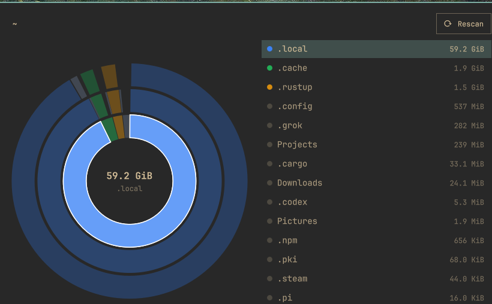
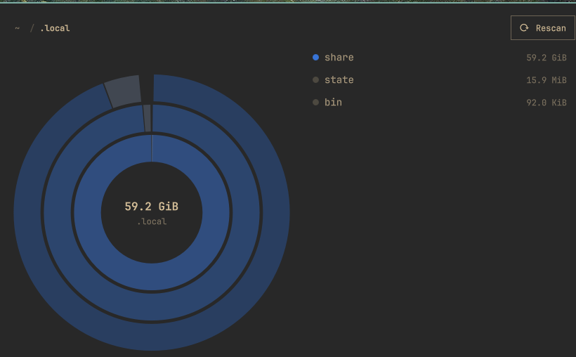

# Omadisk

See what is eating the disk without leaving the Omarchy bar.

Omadisk is a read-only DaisyDisk-style explorer for [Omarchy](https://omarchy.org). A hard-disk icon sits on the bar. Click it and a panel peeks out underneath — the same chrome as Network and Display — with a sunburst map, a folder list, and breadcrumbs.

Hover a slice and the matching row lights up. Click either side to drill in. Escape goes up one folder, or closes the panel at the scan root.

Plugin id: `postman.omadisk` · License: [MIT](LICENSE) · Kind: bar widget

The UI never walks the filesystem. A small Rust scanner (`omadisk-scan`) streams a capped NDJSON view so the single `omarchy-shell` process stays responsive.

## Screenshots

Home directory, largest child selected:



Drilled into `~/.local`:



## Install

`omarchy plugin add` clones the plugin. It does not compile the scanner. You need [mise](https://mise.jdx.dev/) (or any Rust toolchain) once, after clone.

```sh
omarchy plugin add https://github.com/kennetpostigo/omadisk.git --enable
cd ~/.config/omarchy/plugins/postman.omadisk
mise install
./scripts/build.sh
omarchy-shell shell rescanPlugins
```

Place the chip if it did not land on the right:

```sh
omarchy plugin enable postman.omadisk --section right
```

Optional Super-menu entry (opt-in; writes only `trigger.omadisk` into your menu extension):

```sh
./scripts/install-menu.sh
```

## Use

Click the disk icon, or:

```sh
omarchy-shell shell toggle postman.omadisk
```

| Key | Action |
| --- | --- |
| `j` / `k` / arrows | Move in the list |
| `l` / Enter | Drill into a folder |
| `h` / Backspace | Go up |
| Esc | Go up, or close at the scan root |
| `r` | Rescan |
| `o` | Open the focused path |
| `y` | Copy the focused path |

v1 is **read-only**. There is no delete, trash, or write into the scanned tree.

Widget settings:

| Key | Default | Meaning |
| --- | --- | --- |
| `root` | empty (`$HOME`) | Directory to scan |
| `refreshIntervalSec` | `30` | How often the chip re-reads free space |
| `showFree` | `false` | Show available space next to the icon |

```sh
omarchy bar move postman.omadisk --section right
```

## How it works

This section is for anyone who wants to change, port, or harden Omadisk. Coding agents should also read [`AGENTS.md`](AGENTS.md). The on-the-wire contract is [`protocol.md`](protocol.md).

### Two processes, one overlay

`omarchy-shell` is one long-lived Quickshell process. It hosts the bar, notifications, lock screen, and every plugin overlay. Walking a home directory from QML or JS would stall the desktop.

Omadisk therefore splits in two:

```
bar/BarWidget.qml          KeyboardPanel peek + bar icon
        │
        ▼
overlay/Overlay.qml        session, hover, drill, Process children
        │
        │  stdout NDJSON (one JSON object per line)
        ▼
target/release/omadisk-scan
        scan | view | stat | proto
```

The overlay never calls `FolderListModel`, never `os.walk`s, and never holds the full tree. It only renders a **capped depth-3 view**: at most 40 slices per ring (plus an Other wedge), 120 slice nodes total, and 200 list rows.

The scanner is launched with `nice -n 10` and `ionice -c 2 -n 7` when those tools exist, so a scan yields to interactive work.

### Scanner (`src/`)

| Module | Job |
| --- | --- |
| `walk.rs` | Iterative walk. Allocated size (`st_blocks * 512`) by default. One filesystem. Hardlinks counted once. Directory symlinks not followed. Always skips `/proc`, `/dev`, `/sys`, `/run`. |
| `view.rs` | Projects a focus path to a depth-3 JSON view. Collapses tiny children into `Other`. Caps slice count so QML cannot receive a 41³ tree. |
| `cache.rs` | Atomic publish under `~/.cache/omadisk/scans/<key>/` (`0700` / `0600`). Slot cap 4. Key is `sha256(realpath, metric, stay_on_fs, hardlink_aware)[:16]`. |
| `statfs.rs` | `statvfs` used / free / total for the chip and the status bar. Not a wedge on the chart. |
| `protocol.rs` | Event constructors and parsers. Unknown `type` values are ignored. |
| `main.rs` | CLI: `scan`, `view`, `stat`, `proto`. |

`scan` streams `hello` → `progress` / `skip` / `error` / `view` snapshots → `done`, then atomically replaces `tree.json` + `meta.json`. A signal or abort does **not** publish a partial cache.

`view` prints one `view` event from a published cache (exit `3` on miss). The overlay uses that for instant reopen and for drilling past the live snapshot.

`proto` prints the protocol version and ensures the cache directory exists. The overlay runs it on load so `session.json` writes are allowed.

### Overlay data flow

1. Open → `startSession`. Restore `lastRoot` / `lastFocus` from in-memory `sessionObj` (preferred) or `~/.cache/omadisk/session.json`.
2. `view --root … --path … --depth 3`. Cache hit paints immediately.
3. Cache miss (`exit 3`) starts `scan --root … --emit-view-ms 500`. Live `view` events paint a partial tree while the walk continues.
4. Drill uses `OverlayModel.project` when the path is already inside the last root view; otherwise it asks `view` again. Mid-scan drills that have no subtree yet show an empty partial view (`deeperPending`) and refresh on `done`.
5. Hover is a single `hoverPath` plus a `hoverTick` counter. The sunburst and the list both read that live. Do not clear hover on `MouseArea.onExited` — the pointer crossing from canvas to list would flash empty.
6. Close → `persistSession` writes memory and `session.json`. The next open must not reset focus back to the scan root if a valid descendant is stored.

Slice layout lives in `overlay/OverlayModel.js` (`layoutSlices`, `hitTestSlices`). Colors are a categorical palette, not heat-all-red. `ListModel` must not use a role named `color` — Quickshell treats that as reserved and the sunburst goes monochrome.

Breadcrumb ancestors are drillable even when they are not in the current `list`. `isDrillable` treats a path as a folder if it is the scan root or an ancestor of `focusPath`, not only when `pathKind` found a list row.

### Limits and safety

- Read-only. The scanner `stat`s / `scandir`s. It does not read file contents. It does not write into the scanned tree.
- Cache and session files go only under `~/.cache/omadisk/`. That cache lists every path under the scan root — treat it as private.
- Plugins run unsandboxed inside `omarchy-shell`. Review the source before enabling anything.
- `omarchy plugin add` never runs install hooks. A clone without `./scripts/build.sh` shows a missing-scanner error, it does not compile Rust for you.

### Repository map

```
manifest.json                 plugin id, bar-widget schema
bar/BarWidget.qml             icon + KeyboardPanel host
bar/Model.js                  chip icon / tooltip / stat parse
overlay/Overlay.qml           session, processes, keyboard
overlay/OverlayModel.js       layout, hit-test, project, parse
overlay/SunburstCanvas.qml    filled wedges
overlay/ChildList.qml         sibling list
overlay/BreadcrumbBar.qml     path + Rescan
overlay/HubLabel.qml          selected / focused total
overlay/StatusBar.qml         free space + cache age
overlay/Format.js             human sizes
src/*.rs                      scanner
tests/                        unit + CLI goldens
protocol.md                   NDJSON contract
scripts/build.sh              mise exec cargo build --release
scripts/test.sh               cargo test + plugin validate
scripts/dev-install.sh        symlink into ~/.config/omarchy/plugins
```

### Develop

```sh
mise install
./scripts/test.sh
./scripts/dev-install.sh
./scripts/dev-watch.sh
```

Scanner:

```sh
./target/release/omadisk-scan proto
./target/release/omadisk-scan scan --root "$HOME"
./target/release/omadisk-scan view --root "$HOME"
./target/release/omadisk-scan stat --path "$HOME"
```

`./scripts/test.sh` is the gate: 44 scanner unit tests, 12 CLI tests, `omarchy plugin validate`, and a JSON parse of `manifest.json`.

## Remove

```sh
omarchy plugin disable postman.omadisk
omarchy plugin remove postman.omadisk --yes
rm -rf ~/.cache/omadisk
pkill -f omadisk-scan || true
```

If you added the optional menu trigger, delete the `trigger.omadisk` block from `~/.config/omarchy/extensions/omarchy-menu.jsonc`.

A local symlink install (from `./scripts/dev-install.sh`) is not a git checkout:

```sh
rm -f ~/.config/omarchy/plugins/postman.omadisk
```

## License

MIT. See [LICENSE](LICENSE).
